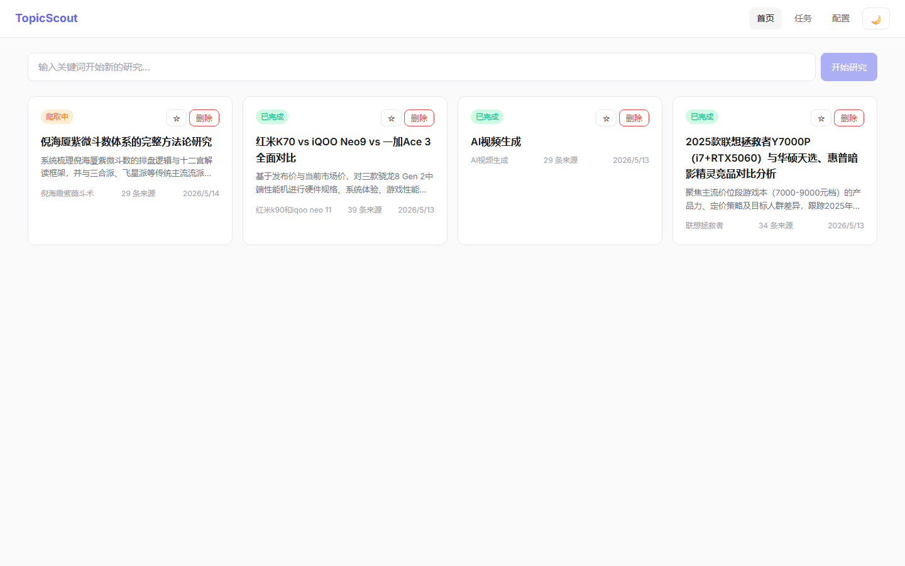
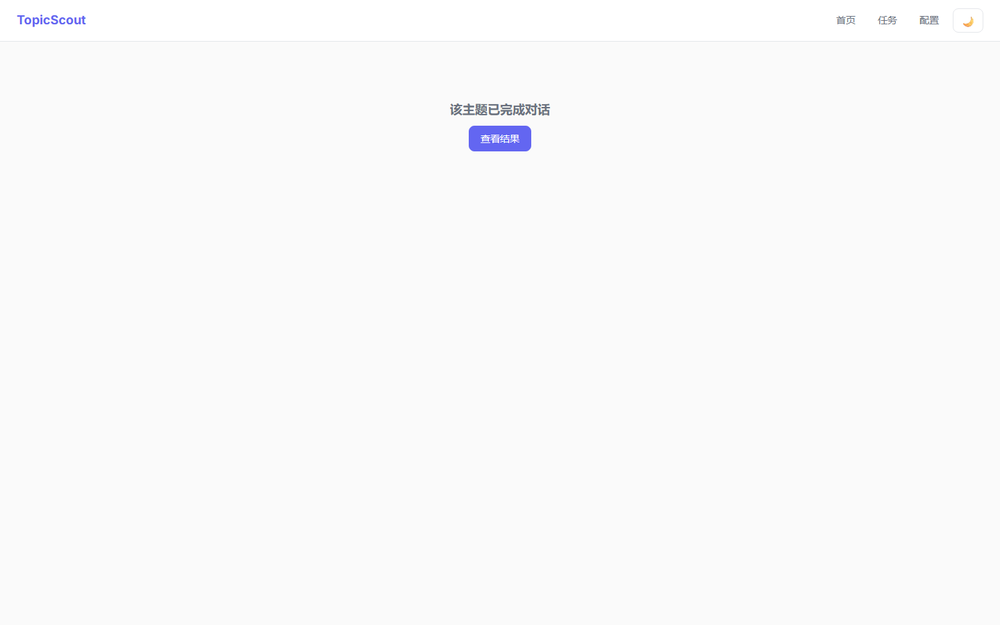
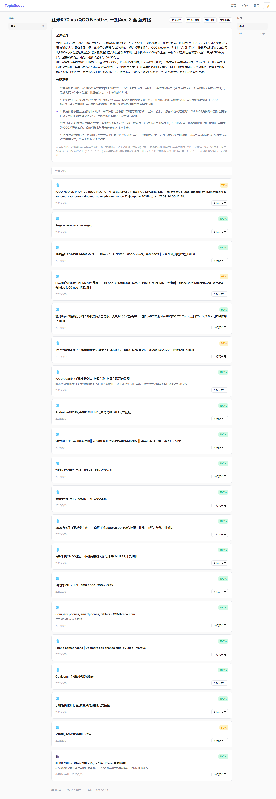
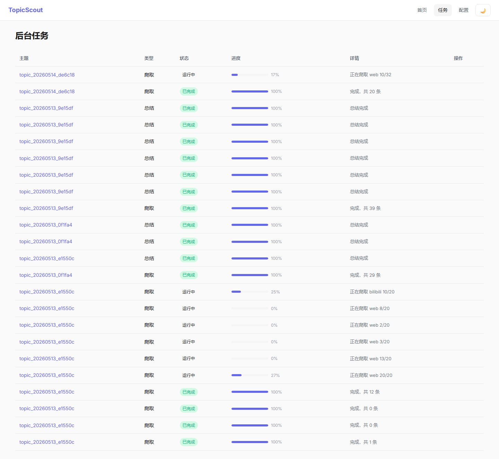
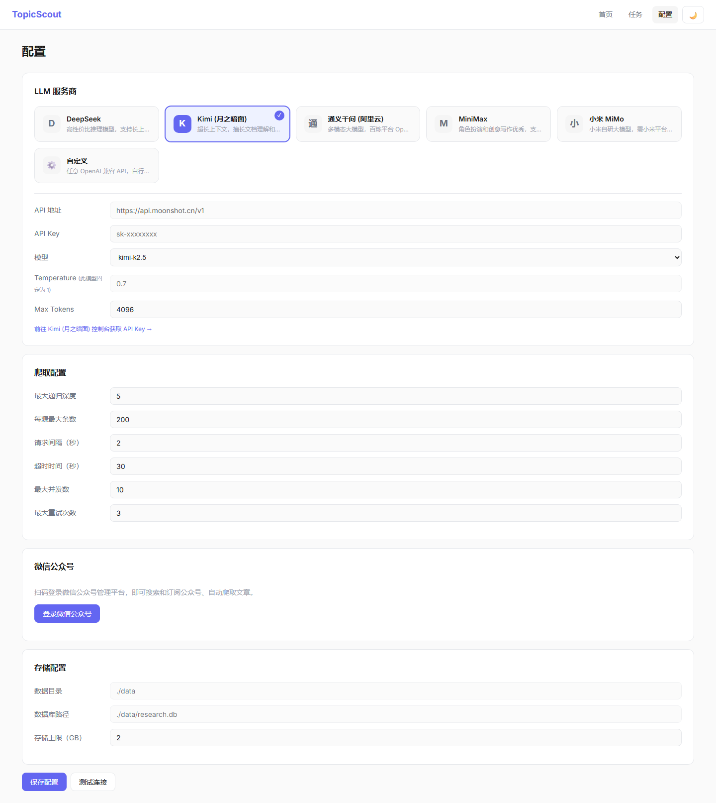

<div align="center">

# TopicScout

**个人研究 Agent — 输入关键词，AI 驱动深度调研，结构化输出**

[](README.md)
[](README_en.md)
[](https://github.com/haodehaode378/TopicScout/stargazers)
[](LICENSE)
[](https://www.python.org/)
[](https://react.dev/)

</div>

---

## 简介

TopicScout 是一个**个人研究 Agent**。输入一个关键词，AI 通过对话帮你明确研究方向，然后深度爬取多源信息，生成结构化报告，支持 PDF 导出和 JSON 复用。

核心流程：

```
关键词 → AI 追问细化 → 深度爬取 → AI 总结归类 → Notion 式展示 → PDF/JSON 导出
```

作为视频生成项目的前置数据源，也可独立用于任何主题的信息调研。

## 截图预览

### 首页 — 主题列表

显示所有研究主题，支持搜索、状态筛选、一键删除。



### AI 对话 — 追问细化

聊天式交互，AI 自动追问直到理解清楚你的研究方向，支持跳过和回退。



### 结果页 — Notion 式展示

三栏布局：左侧分类筛选、中间来源卡片列表、右侧版本管理。支持实时编辑、标记有用、图片预览。



### 任务页 — 后台进度

实时进度条 + SSE 推送，爬取状态一目了然。



### 配置页 — LLM + 爬取 + 微信公众号

支持多种 LLM 服务商卡片式选择、爬取参数调节、微信公众号扫码登录订阅。



## 功能特性

| 功能 | 说明 |
|------|------|
| AI 对话 | 聊天式追问，自动判断何时理解清楚，支持跳过和回退 |
| 多源爬取 | 通用网页、B站、抖音、微博、知乎、小红书、微信公众号 |
| 智能总结 | 全局总结 + 关键洞察 + 信息可靠度评估 |
| 自动归类 | AI 自动将来源归入 3-8 个类别 |
| Notion 式展示 | 三栏布局：分类筛选 / 来源卡片 / 版本管理 |
| 版本管理 | 每次爬取生成新版本，可切换查看历史版本 |
| 实时进度 | SSE 推送爬取进度，进度条实时更新 |
| 导出 | PDF（封面+目录+正文）/ JSON 结构化复用 |
| 微信公众号 | 扫码登录 → 搜索订阅公众号 → 自动爬取文章 |
| 深色/浅色 | CSS 变量主题切换，localStorage 持久化 |

## 快速开始

### 环境要求

- Python 3.13+
- Node.js 18+

### 安装

```bash
git clone https://github.com/haodehaode378/TopicScout.git
cd TopicScout

# 后端
pip install -e .
playwright install chromium

# 前端
cd frontend
npm install
cd ..
```

### 配置

```bash
cp .env.example .env
# 编辑 .env，填入 LLM API Key
```

### 启动

```bash
# 终端 1：后端
python -m topic_scout serve

# 终端 2：前端
cd frontend && npm run dev
```

打开 http://localhost:3783 即可使用。

## 技术栈

| 层次 | 技术 | 说明 |
|------|------|------|
| 后端 | Python 3.13 + FastAPI | 异步爬虫、轻量 API |
| 前端 | React 18 + TypeScript + Vite | Notion 风格 UI |
| 数据库 | SQLite + aiosqlite | 轻量存储，无需额外服务 |
| LLM | OpenAI 兼容格式 | 支持 DeepSeek / Kimi / MiniMax / 通义千问 / MiMo |
| 爬虫 | httpx + Playwright | 通用网页 + 国内平台 + 微信公众号 |
| PDF | WeasyPrint | HTML 直转 PDF |
| 动画 | Framer Motion | 卡片展开、进度条、入场动画 |

## 项目结构

```
topic_scout/
├── __main__.py          # CLI 入口
├── config.py            # Dataclass 配置
├── models.py            # 数据模型
├── llm.py               # LLM 适配器
├── chat.py              # AI 追问对话
├── wx_auth.py           # 微信扫码登录（Playwright）
├── wx_api.py            # 微信公众号 API 调用
├── wx_token.py          # 凭证持久化
├── crawler/
│   ├── base.py          # 爬虫基类
│   ├── web.py           # 通用网页
│   ├── bilibili.py      # B站
│   ├── douyin.py        # 抖音
│   ├── weibo.py         # 微博
│   ├── zhihu.py         # 知乎
│   ├── xiaohongshu.py   # 小红书
│   └── wechat.py        # 微信公众号
├── summarizer.py        # AI 总结 + 归类
├── exporter.py          # JSON / PDF 导出
├── server.py            # FastAPI 服务
└── db.py                # SQLite CRUD

frontend/src/
├── App.tsx              # 路由 + 主题切换
├── components/
│   ├── HomePage.tsx     # 主题列表
│   ├── ChatPage.tsx     # AI 对话
│   ├── ResultPage.tsx   # Notion 式结果页
│   ├── SourceCard.tsx   # 来源卡片
│   ├── TasksPage.tsx    # 任务列表
│   ├── ConfigPage.tsx   # 配置面板
│   └── ...
└── lib/
    ├── api.ts           # API 客户端
    └── types.ts         # TypeScript 类型
```

## API 端点

<details>
<summary>点击展开完整 API 列表</summary>

### 主题
| 方法 | 路径 | 说明 |
|------|------|------|
| POST | `/api/topics` | 创建主题 |
| GET | `/api/topics` | 主题列表 |
| GET | `/api/topics/:id` | 主题详情 |
| DELETE | `/api/topics/:id` | 删除主题 |

### AI 对话
| 方法 | 路径 | 说明 |
|------|------|------|
| POST | `/api/topics/:id/chat` | 发送消息 |
| GET | `/api/topics/:id/chat` | 对话历史 |
| POST | `/api/topics/:id/confirm` | 确认主题 |

### 爬取
| 方法 | 路径 | 说明 |
|------|------|------|
| POST | `/api/topics/:id/crawl` | 触发爬取 |
| GET | `/api/topics/:id/crawl/status` | 爬取进度 (SSE) |
| GET | `/api/topics/:id/sources` | 爬取结果 |
| PATCH | `/api/topics/:id/sources/:src_id` | 编辑来源 |

### 总结 & 导出
| 方法 | 路径 | 说明 |
|------|------|------|
| POST | `/api/topics/:id/summarize` | 触发总结 |
| GET | `/api/topics/:id/summary` | 获取总结 |
| GET | `/api/topics/:id/export/json` | 导出 JSON |
| POST | `/api/topics/:id/export/pdf` | 导出 PDF |

### 微信公众号
| 方法 | 路径 | 说明 |
|------|------|------|
| POST | `/api/wx/login` | 启动扫码登录 |
| GET | `/api/wx/status` | 登录状态 |
| GET | `/api/wx/qrcode` | QR 码图片 |
| POST | `/api/wx/logout` | 退出登录 |
| POST | `/api/wx/search` | 搜索公众号 |
| POST | `/api/wx/subscribe` | 订阅公众号 |
| GET | `/api/wx/accounts` | 已订阅列表 |
| DELETE | `/api/wx/accounts/:fakeid` | 取消订阅 |

### 任务 & 配置
| 方法 | 路径 | 说明 |
|------|------|------|
| GET | `/api/tasks` | 任务列表 |
| POST | `/api/tasks/:id/retry` | 重试任务 |
| GET | `/api/config` | 获取配置 |
| PUT | `/api/config` | 更新配置 |

</details>

## LLM 配置

支持 OpenAI 兼容格式，前端可配：

| 服务商 | base_url |
|--------|----------|
| DeepSeek | `https://api.deepseek.com` |
| Kimi | `https://api.moonshot.cn/v1` |
| MiniMax | `https://api.minimaxi.com/v1` |
| 通义千问 | `https://dashscope.aliyuncs.com/compatible-mode/v1` |
| 小米 MiMo | `https://api.xiaomimimo.com/v1` |

## 微信公众号集成

TopicScout 内置微信公众号爬取能力：

1. **扫码登录**：配置页点击"登录微信公众号"，用手机微信扫码
2. **搜索订阅**：搜索公众号名称，一键订阅
3. **自动爬取**：创建主题选择 wechat 平台，自动从已订阅公众号抓取文章

技术方案：Playwright 无头浏览器模拟登录 → 获取 token + cookies → httpx 调用 MP 平台 API。

## 测试

```bash
# 后端测试
python -m pytest tests/ -v

# 前端类型检查
cd frontend && npx tsc --noEmit

# 前端构建
cd frontend && npx vite build
```

## 参考项目

| 项目 | Stars | 参考点 |
|------|-------|--------|
| [MediaCrawler](https://github.com/NanmiCoder/MediaCrawler) | 49k+ | 国内平台爬虫架构 |
| [gpt-researcher](https://github.com/assafelovic/gpt-researcher) | 27k+ | planner+execution 架构 |
| [crawl4ai](https://github.com/unclecode/crawl4ai) | 65k+ | LLM 友好的网页爬取 |
| [we-mp-rss](https://github.com/rachelos/we-mp-rss) | — | 微信公众号爬取参考 |

## 贡献

欢迎提交 Issue 和 Pull Request。

## License

[MIT](LICENSE)
